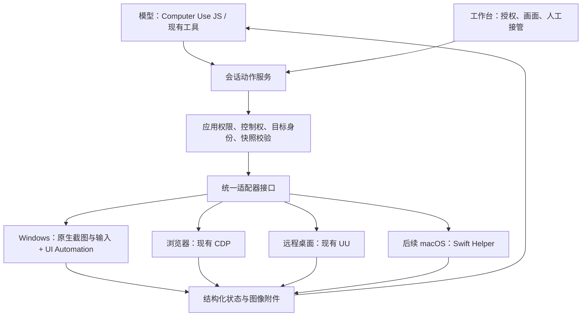

# Computer Use 完整移植方案

适用版本：DeepSeek Harness Rust `0.1.3-alpha.20`  
规划日期：2026-09-15  
上游对齐基线：cc-haha `01c149061df38ef0ef1c01a50de1a1709d035938`  
状态：Windows 首轮能力已实现，正在进行发布前回归；macOS/Linux 为条件能力，当前仅完成协议与跨平台构建验证。

## 1. 目标与技术路线

复用现有 Rust 桌面控制、浏览器 CDP、UU 远程桌面及会话管理，移植 cc-haha 的应用授权、批量操作和持久化 JavaScript 交互机制，并通过 Windows UI Automation 补齐控件识别与语义操作。

首个交付目标为 Windows 完整体验：应用发现、授权、观察、操作、结果验证、人工接管和资源释放形成闭环。主机默认走本机适配器；只有显式指定远程目标时才走绑定 UU。macOS/Linux 因当前没有真机，按协议和构建矩阵验收，原生客户端完整操作界面另行交付。

基础桌面控制继续使用 Rust 原生执行器；持久化 JavaScript 使用独立受限进程，复用现有 Node 运行设施。所有桌面动作统一经过 Rust Host 的权限、目标身份与控制权检查。

## 2. 上游能力边界

上游文档与当前源码存在差异，功能对齐以固定提交的实际工具注册和执行路径为准。

| 平台 | 实际实现 | 移植含义 |
| --- | --- | --- |
| Windows | Python 执行器、截图坐标操作、应用分级授权、批量操作 | 将操作与授权协议适配到现有 Rust 执行器 |
| macOS | Swift 原生服务、应用控件树、窗口定向操作、持久化 JS；模型入口为 `js` 和 `js_reset` | 在 Windows 上实现同类体验，需要新增 UIA 与 JS 运行隔离适配 |
| Linux | 上游当前 Computer Use 平台判断不支持 | 需要单独设计执行器，不属于现成功能移植 |

Teach 属于条件能力，应按实际 capability 单独登记与验收；存在工具 schema 不代表运行时默认可用。浏览器 DOM 与标签页服务也不属于上游原生 App JS 接口的现成功能。

## 3. 当前基础与主要差距

以下现状来自代码检查，不等同于完整真机验收。

| 能力 | 当前基础 | 实施安排 |
| --- | --- | --- |
| 截图、点击、输入、拖拽、滚动 | 已有 Windows 原生实现 | 复用并补齐动作差距 |
| 窗口绑定、前台检查、坐标映射 | 已有实现 | 增加应用身份与快照版本校验 |
| 人工接管、暂停恢复、输入释放 | 已有实现 | 覆盖新增动作与批处理 |
| 会话隔离、取消、超时、进程回收 | 已有实现 | 扩展至授权、应用句柄与 JS 内核 |
| 浏览器 CDP、UU 远程桌面 | 已有独立适配器 | 保持兼容，统一能力描述 |
| 应用授权 | 工具级审批与控制权已接入 | 持久化应用级授权、剪贴板细分权限仍需后续补齐 |
| 控件树与语义操作 | Windows UI Automation 已接入 | 继续扩充真实应用矩阵 |
| 持久化 JS | 专用受限 Node 内核已接入 | 发布包需随附 Node 25+ 运行时并继续做资源回收回归 |
| 操作界面 | 已有 Web 工作台；原生客户端以阅读为主 | 首轮完善 Web 工作台，原生界面单独排期 |

## 4. 目标架构



### 4.1 会话与目标协议

- `AppRef`：关联应用标识、进程及进程生命周期，防止 PID 复用。
- `WindowRef`：绑定所属应用和目标窗口，防止窗口句柄复用。
- `SnapshotId`：绑定截图、控件树、坐标几何与观察版本。
- `ElementRef`：控件的不透明引用，仅在对应快照和目标上下文中有效。
- `Capabilities`：描述实际可用的语义操作、截图、输入、剪贴板、显示器、批处理等能力。

输入动作必须重新校验目标与控制权。应用重启、目标窗口变化、人工接管及相关状态失效后，旧引用不得继续用于操作。

### 4.2 应用授权

复用现有审批服务，增加 `read / click / full` 应用权限，以及剪贴板读取、剪贴板写入、系统快捷键的独立授权。会话授权与长期预授权分别保存，支持撤销。

截图范围必须明确区分目标窗口与整屏；输入授权不能被解释为截图过滤保证。模型、JS 和工作台入口共享授权判定，但保留可信的人类与智能体来源标记。

### 4.3 控件与坐标操作

通过 UI Automation 获取控件名称、类型、状态、边界和可用操作模式；支持按钮调用、字段赋值、选择、滚动和文本选择。控件不支持相应操作时，返回明确能力状态，并允许在授权范围内使用截图坐标操作。

UIA 调用放在独立 MTA 工作线程，设置遍历深度、节点数量和时间预算；为底层调用卡死提供进程隔离及回收路径。

### 4.4 持久化 JavaScript

新增 `computer_use_js` 和 `computer_use_js_reset`，支持应用对象、跨调用变量、顺序循环及文本和图片输出。示例目标接口：

```javascript
let app = await cua.getApp("记事本");
await app.typeText("测试文本");
await app.getAXStateAndScreenshot();
```

JS 内核只持有受约束的动作接口，不持有应用授权的决定权。每个动作通过 Host 校验，文件、网络、模块加载及进程能力不向脚本开放；隔离不能仅依赖 JavaScript `vm`。

限制代码长度、动作数量、执行时间、输出和内存。取消或超时后停止接收新动作，处理已进入执行器的动作并返回完成数量与不确定结果；重新观察后才能继续。调用结束后的异步任务不得继续注入输入。

## 5. 实施阶段与验收

| 阶段 | 工作内容 | 验收结果 |
| --- | --- | --- |
| P0：协议与验证 | 冻结上游基线；建立逐项能力矩阵；定义目标、快照和错误协议 | 目标、快照、路由和 JS 隔离测试已通过 |
| P1：基础操作与授权 | 应用发现/启动、截图、控制权、取消与路由 | Windows 原生测试及适配器回归已通过；应用细分授权待补 |
| P2：Windows 语义层 | 控件树、快照引用、语义操作与坐标回退 | 自有 Win32 控件和过期引用测试已通过，真实应用矩阵待发布前继续执行 |
| P3：持久化 JS | 独立内核、会话绑定、应用 API、输出、重置、取消与资源限制 | Node 26 隔离、跨调用变量、死循环、迟到动作测试已通过 |
| P4：产品与打包 | 工作台授权和状态界面；模型能力注册；诊断、配置与发布资源 | 模型收到真实图像；不声明缺失能力；干净环境安装与诊断可用 |
| P5：完整回归 | 浏览器、UU、外部命令兼容；异常恢复与真实任务验收 | 核心闭环及回归矩阵全部通过 |

顺序依赖：P0 → P1 → P2 → P3 → P4 → P5。P0 的验证结果用于细化工期，避免在控件可访问性和运行隔离未确定前承诺完成日期。

## 6. 代码落点

| 模块 | 职责 |
| --- | --- |
| `crates/computer-use/tool-computer-use-command/` | 保留 Runtime、Adapter 与控制权管理；扩展协议、能力和动作分发 |
| `crates/computer-use/desktop-controller/` | 扩展 Windows 原生操作；增加应用身份、显示器、剪贴板及 UIA 接口 |
| Computer Use 专用会话模块（新增，位置在 P0 确定） | 应用授权状态、快照与控件引用、批处理状态 |
| Computer Use JS 模块（新增，位置在 P0 确定） | 持久内核、JS API、资源边界及图像输出 |
| `crates/code-runtime/code-runtime-node/` | 复用启动和进程管理设施；保持现有通用执行语义 |
| `crates/interaction/user-approval/` | 承载应用授权请求、决定、撤销及审计 |
| `crates/host/dsh-host/` | HTTP、模型能力、设置、生命周期及附件整合 |
| `release/plugins/dsh-sidebar-workbench-suite/lib/client.js` | 工作台应用选择、授权、观察与接管交互 |
| `web/src/runtime-plugins/` | 设置与工具卡片等现有前端入口 |
| `tools/` 与相关 crate 测试 | 维护正式回归用例与发布检查 |

实施前需确认前端各入口的源文件与发布资源构建关系，避免只修改生成文件而在构建后丢失功能。

## 7. 验证矩阵与完成标准

### 7.1 真实应用

| 场景 | 验证重点 |
| --- | --- |
| 记事本 | 中文输入、文本选择、快捷键、应用重启 |
| 资源管理器 | 应用/窗口选择、列表操作、滚动与弹窗 |
| WPS Office | 文档界面控件、输入与焦点切换、坐标回退 |
| Electron 应用 | 控件树不完整时的截图操作 |
| 受控浏览器 | 现有 CDP、标签页和截图链路回归 |
| UU 远程桌面 | 延迟、断线、人工接管和恢复 |

### 7.2 异常与边界

- 多显示器、负坐标、混合 DPI、窗口移动及尺寸变化。
- 应用退出、PID/窗口句柄复用、控件重建与快照失效。
- 多任务争用同一设备，以及多个 Host 进程间的物理桌面互斥。
- 人工输入、停止、接管、锁屏、控制器崩溃与输入释放失败。
- 剪贴板使用与恢复，授权撤销，模型图像输入能力缺失。
- JS 无限循环、过量输出、迟到异步调用、内核重置与部分执行失败。

自动化测试默认使用模拟执行器或专用测试应用；真实桌面输入测试在明确隔离的测试环境执行。

### 7.3 完成定义

1. 应用发现 → 授权 → 观察 → 操作 → 验证 → 释放控制权的完整任务通过。
2. 控件操作与坐标操作均有真实应用成功案例。
3. JS 连续调用、任务隔离、暂停恢复与失败后续接通过。
4. 人工接管立即阻止后续智能体动作，恢复后重新观察。
5. 原有浏览器、UU 和外部命令协议通过兼容回归。
6. 发布包包含匹配版本的控制器、JS 资源和运行依赖，干净环境可运行。
7. 条件能力与未支持平台在设置、工具声明和文档中保持一致。

## 8. 后续交付范围

- **macOS**：适配 Swift Helper，完成签名、系统授权、进程通信及真机测试。
- **原生客户端**：在现有会话阅读能力之外实现授权、画面、状态与人工接管界面。
- **Teach**：明确产品入口、授权与退出语义后单独实施，不以工具定义替代功能验收。
- **Linux**：另行设计桌面执行器与平台权限机制。

直接复用的上游代码需保留适用的版权与许可声明，并记录实际引入文件及依赖。

## 9. 技术依据

- [cc-haha 平台工具注册与会话分发](https://github.com/NanmiCoder/cc-haha/blob/01c149061df38ef0ef1c01a50de1a1709d035938/src/vendor/computer-use-mcp/mcpServer.ts)
- [cc-haha Windows 工具定义](https://github.com/NanmiCoder/cc-haha/blob/01c149061df38ef0ef1c01a50de1a1709d035938/src/vendor/computer-use-mcp/windowsLegacyTools.ts)
- [cc-haha 平台执行器](https://github.com/NanmiCoder/cc-haha/blob/01c149061df38ef0ef1c01a50de1a1709d035938/src/utils/computerUse/executor.ts)
- [cc-haha 持久化 JS 运行时](https://github.com/NanmiCoder/cc-haha/blob/01c149061df38ef0ef1c01a50de1a1709d035938/src/utils/computerUse/replRuntime.ts)
- [cc-haha JS 应用接口](https://github.com/NanmiCoder/cc-haha/blob/01c149061df38ef0ef1c01a50de1a1709d035938/src/vendor/computer-use-mcp/replApi.ts)
- [Microsoft UI Automation 控件模式](https://learn.microsoft.com/en-us/windows/win32/winauto/uiauto-controlpatternsoverview)
- [Microsoft UI Automation 线程要求](https://learn.microsoft.com/en-us/windows/win32/winauto/uiauto-threading)
