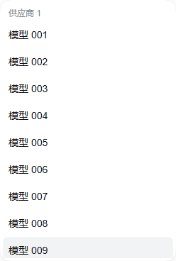
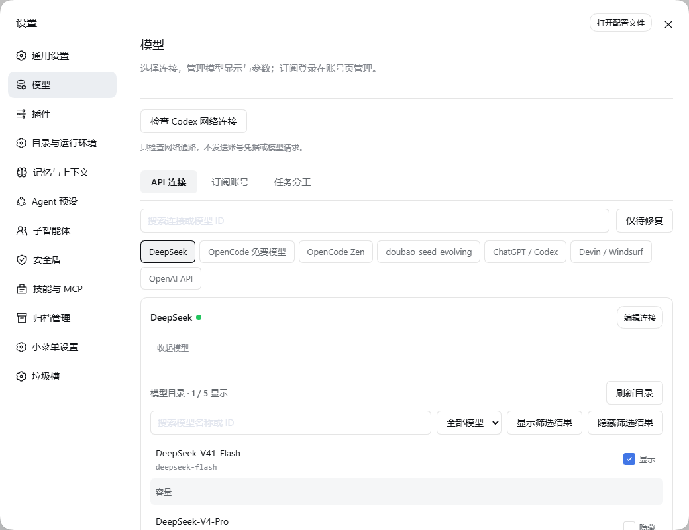
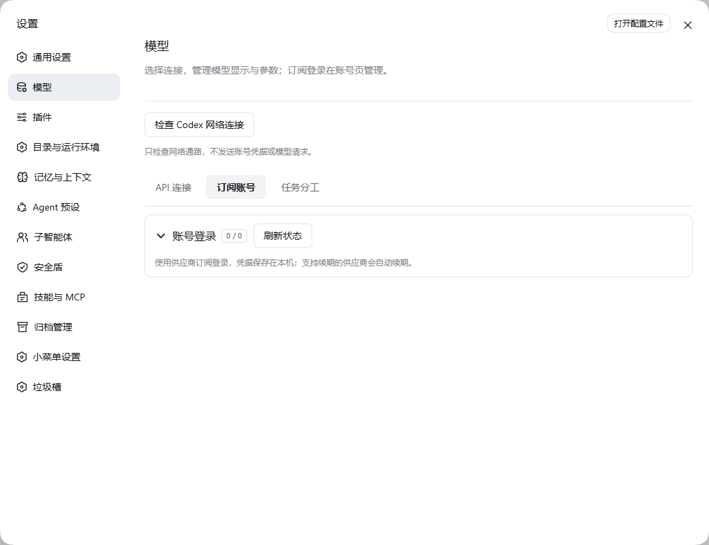
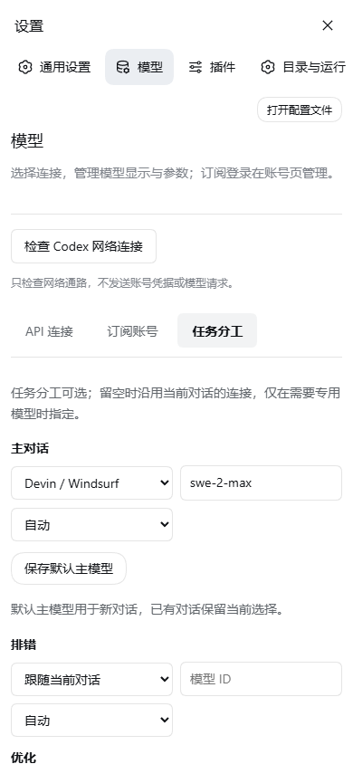

# DeepSeek Harness UI 体验分析与优化建议

**评估日期：2026 年 9 月 16 日**  
**评估对象：Web 工作台、设置、API 连接、订阅账号、模型选择与任务模型配置**

## 1. 核心判断

当前界面已经具备较完整的功能基础，但主要交互仍围绕配置结构组织，缺少围绕“快速选模型、管理常用模型、连接账号、修复故障”的连续操作路径。模型数量增加后，原本需要几次点击的小问题会累积为持续的查找、滚动和重复配置成本。

最应优先解决的是：**已保存模型不能直接删除、模型选择器缺少搜索、Devin 登录需要遥控截图、关闭设置会丢失未保存修改，以及会话切换模型时同时改写全局默认模型。** 这些问题涉及操作闭环和状态可信度，调整颜色、圆角或按钮大小无法单独解决。

| 判断 | 具体表现 | 优化方向 |
| --- | --- | --- |
| 日常使用与管理操作混杂 | 模型设置顶部长期展示“检查 Codex 网络连接” | 选择模型、管理目录、账号授权、故障诊断分别提供明确入口 |
| 模型生命周期不完整 | 手动添加的模型保存后失去移除入口 | 完整支持添加、编辑、收藏、隐藏、移除和恢复 |
| 大量模型缺乏组织方式 | 会话选择器全量平铺；设置只能按连接逐个管理 | 搜索、收藏、最近使用、能力筛选、跨连接列表、明确的批量选择 |
| 保存范围不够可信 | 未保存草稿直接丢失；当前会话选择同时影响新会话默认值 | 清晰区分草稿、持久设置、当前会话与新会话默认值 |
| 登录路径负担过大 | 点击截图中的输入框，再在外部密码框输入并发送 | 本机优先系统浏览器；远程访问提供明确的替代授权方式 |

报告共列出 **24 项问题：P1 级 8 项、P2 级 16 项**。P1 表示优先修复的操作闭环、状态误解、误操作或可访问性问题；P2 表示明显增加操作成本或扩展成本的问题。未将局部体验问题判定为产品整体不可用。

## 2. 核验范围与证据边界

采用实际页面检查、交互复现、当前前端组件隔离验证和实现核对。覆盖 1440×960、1280×720 与 390×844 三种视口；大量模型场景使用 150 条目录和 10 个连接、共 500 个模型的隔离数据。

证据分为三类：**实测**表示实际页面可复现；**组件验证**表示使用当前组件与隔离数据复现；**实现确认**表示可从执行路径确认，但未在真实账号上执行对应操作。规模数据用于检验交互结构，不等同于真实使用时长或性能压测结果。

真实供应商授权完成率、验证码通过率、第三方风控、模型请求速度和额度变化不在本报告的实测结论范围内。登录问题依据现有控件、输入机制、授权分支和文档约定评估。

### 已有能力应当保留

- 设置中的模型管理已经有名称/ID 搜索、显示状态筛选、筛选结果批量显示/隐藏、每次 100 条的“加载更多”和底部吸附保存区。
- 模型显示偏好与账号范围有关；保存过程包含版本冲突检查，账号变化时也有保护逻辑。
- 当前模型已隐藏或不可用时，选择按钮具有相应状态标记；不应在重构时丢失这些提示。
- 订阅登录已经有取消、轮询、暂时中断重试和凭据隔离基础。
- 小屏设置已采用全屏布局，390 像素宽视口未观察到整个页面横向溢出。

因此，准确的问题是**这些能力分布不一致、作用范围不够清楚，且会话中的高频选择器缺乏同等级的检索能力**，不能笼统描述成“所有页面都没有搜索”或“完全没有批量操作”。

## 3. 关键问题详解

### U01 · 已保存模型缺少删除入口 · P1

**证据：实测、组件验证、实现确认。**

API 连接和订阅账号使用的主要模型管理器，对已有模型提供显示开关及“容量”展开项，却没有删除按钮。手动添加时存在“移除草稿”，保存之后该按钮消失。隔离验证中，新增手动模型保存前有“移除草稿”，保存后该行没有任何移除按钮。

创建自定义连接的表单中还存在另一套模型编辑器，其中有删除图标；但普通连接编辑入口显式将模型交给独立管理器管理，不会因此补齐已有模型的删除能力。这是**创建与后续维护能力不对称**，并非单纯图标不明显。

“隐藏”也不能替代删除：隐藏条目仍然存在于管理目录，模型越来越多时会形成长期积累；而删除整个提供方又会影响其余模型和连接配置。

**建议：每行增加“更多”菜单，按模型来源提供准确操作。**

| 模型类型 | 行操作 | 持久行为 |
| --- | --- | --- |
| 手动添加 | 编辑、收藏、隐藏、删除模型 | 删除该条模型定义及相应偏好，保留同连接的其他模型 |
| 从目录加入 | 收藏、隐藏、从我的模型移除 | 从个人使用清单移除，服务端目录仍可查找并重新添加 |
| 内置目录模型 | 收藏、隐藏、从我的模型移除 | 记录移除偏好，刷新目录后不自动回到个人清单 |
| 正在被默认路由或任务引用 | 查看引用、更换引用后移除 | 不允许在用户不知情时留下不可用的默认配置 |

不必把服务器提供的模型“真的删除”才能满足管理需求，关键是将**服务端目录**和**个人使用清单**分开。历史会话继续保留原模型名称和记录；正在运行的任务维持已开始时的配置。

**验收：**手动模型保存、重新打开设置后仍可删除；删除后刷新不复活；移除目录模型可恢复；只移除目标模型；依赖检查能覆盖默认主模型和任务分工。

### U02 · 会话模型选择器无法应对大量模型 · P1

**证据：组件验证、实现确认。**

会话中的模型按钮先打开一个仅含“模型”和可选“推理强度”的根菜单，还要再点一次“模型”才进入候选列表。候选列表按供应商分组，但没有搜索、收藏、最近使用、组折叠或能力筛选。

500 模型场景中，组件一次生成 500 个选项，列表可视高度约 **360 px**，内容总高度 **19,296 px**，约相当于 **54 个可视列表高度**。这说明查找主要依赖滚动；该数字不代表已测得 54 次滚轮操作，也不代表已证实页面卡顿。



**建议：点击模型按钮直接打开可搜索选择面板。**

1. 顶部固定搜索框，支持模型名称、模型 ID、连接名称；打开后搜索框获得焦点。
2. 默认显示“当前模型、收藏、最近使用”，再显示完整目录；同一条目避免重复占位。
3. 选项显示模型名称、连接或账号别名、必要能力标记；同名模型必须能区分。
4. 推理强度显示在当前模型区域，作为独立控件，避免成为查看模型列表前的中间层。
5. 底部提供“管理模型”，直接打开对应连接或模型详情。
6. 长列表采用虚拟滚动或受控分页，搜索作用于完整数据，不限于已渲染行。

建议采用可编辑 combobox 与 listbox 的交互结构，保留方向键导航、Enter 确认、Esc 关闭和焦点恢复；输入与候选列表的关联可按 [W3C APG Combobox Pattern](https://www.w3.org/WAI/ARIA/apg/patterns/combobox/) 实现。

**验收：**常用模型在“打开—选择”两次点击内完成切换；500 模型场景可直接搜索末尾模型；同名模型不会混淆；搜索后仍可用键盘完成选择；没有匹配项时给出清除筛选和管理入口。

### U03 · Codex 诊断入口长期占据模型设置顶部 · P2

**证据：实测、实现确认。**

实际文案是“检查 Codex 网络连接”。它位于模型标题说明之后、API 连接/订阅账号/任务分工标签之前，三个标签下都出现，且不随当前供应商改变。在 DeepSeek、Devin 或任务分工上下文中，这个入口也会优先进入视野。

该按钮来源于设置扩展插槽的固定挂载位置，并非大量模型触发的特殊状态；它也没有出现在本报告检查的会话模型选择组件中。需要区分**设置导航里的“模型”**与**会话输入区的模型按钮**。

问题同时存在于位置和能力表述：它只检查网络通路，不能代表账号已授权、余额可用、模型可调用或工具调用正常。

**建议：**移入“ChatGPT / Codex 账号 → 连接诊断”，或统一的“连接详情 → 诊断”。正常状态默认收起；相关请求失败时才在错误附近提示“检查连接”。结果明确区分网络、授权、模型访问三层状态。

**验收：**DeepSeek API 和任务分工页面首屏不出现 Codex 专属按钮；Codex 的错误入口可一步定位诊断；网络通过不能显示为“模型已可用”。



### U04 · Devin 登录被实现为截图遥控，输入路径过长 · P1

**证据：组件验证、实现确认。**

当内置授权浏览器可用时，授权页以截图展示，用户需要点击截图中的目标输入框，再在截图外的输入栏键入内容并点击“发送输入”；Tab、Enter、Backspace 还各有单独按钮。图像定期刷新，前端捕获间隔为 1.5 秒，这只是轮询配置，不代表固定交互延迟。

外部输入栏统一使用 password 类型，即使输入邮箱也被遮挡；浏览器自身的密码管理器、字段识别、输入法和自然键盘操作无法直接作用于截图中的真实控件。界面还同时提供“打开登录页面”，用户需要自行判断两种方式的区别。

**建议：按访问环境选择主路径，并让页面只强调一种主要操作。**

| 环境 | 主路径 | 辅助路径 |
| --- | --- | --- |
| 在 Host 本机使用 | 点击“连接 Devin”后打开系统浏览器，回到工作台自动确认 | 浏览器未打开时重新打开或复制授权地址 |
| 其他设备访问 Host | 明确提示授权需要完成的位置；在 Host 打开或使用受支持的远程授权方式 | 经说明后进入远程授权视图 |
| 供应商要求特定验证流程 | 展示供应商支持的授权方式与当前步骤 | 失败后提供对应解决操作 |

当前 Devin 回调指向 Host 本机，不能把“在手机上随便打开授权链接”当作通用解决方案；也不能假设供应商必然支持设备码。系统浏览器打开失败时保留用户可点击的链接，避免浏览器弹窗限制使流程中断。

远程截图方案可以保留为兼容路径，但应有聚焦指示、可直接键盘输入、整页查看、明确的输入失败反馈，避免要求用户持续点击“发送输入”。若文本发送失败，应保留可重试的输入；当前实现会先清空外部输入栏，再发送请求。

**验收：**本机主流程不要求外置文本框或按键按钮；授权后明确展示账号身份和成功状态；取消与过期后可重新发起；远程访问不误导用户到错误设备的本地回调；失败不无声清空待发送内容。

### U05 · Esc 可直接丢弃模型草稿 · P1

**证据：实测、实现确认。**

复现路径：进入 API 连接，改变一个模型的显示开关，页面出现“有未保存的模型更改”；按 Esc 后设置直接关闭，没有保存或放弃提示；重新打开，回到“通用设置”，再次进入模型页时开关恢复为原值。

设置容器的 Esc、关闭按钮和遮罩点击直接执行关闭；模型草稿保存在被关闭的组件中。底部存在保存区并不能消除该问题。任务分工也是局部草稿，切换其标签时组件会卸载，需要纳入同一套离开保护。

**建议：**建立统一的未保存状态登记；有草稿时，关闭、切换设置模块、切换会导致卸载的子页采用相同规则：“保存并离开 / 放弃修改 / 继续编辑”。在同一模块内部临时切换连接时可保留草稿，并展示未保存标记。无草稿时直接离开，不增加确认。

**验收：**Esc、关闭按钮、遮罩、设置导航、任务标签切换逐一验证；校验失败时留在编辑页；保存失败时保留草稿；取消离开不改变任何输入。

### U06 · 切换当前会话模型会同时改写全局默认模型 · P1

**证据：组件验证、实现确认。**

模型选择成功后，客户端继续调用默认模型保存逻辑，写入 `agent-default-model`。隔离验证可观察到先执行会话选择，再执行全局默认写入。与此同时，“任务分工”另有“保存默认主模型”，并说明默认值用于新对话。

因此，用户只是给当前任务试用另一个模型，可能改变以后新建会话的默认模型。推理强度也通过同一选择链路提交。界面没有在选择时说明这一影响，两个入口容易互相覆盖。

**建议：**默认只切换当前会话；“设为新对话默认模型”作为单独、明确的操作。全局设置、工作区默认值（若产品需要）和当前会话选择分别展示作用范围，禁止依靠最近一次点击隐式决定全部默认行为。

**验收：**会话 A 从模型甲切到模型乙后，新会话仍采用已明确保存的默认模型甲；只有执行“设为默认”后，新会话才变化；任务分工页面始终准确反映最终默认配置。

### U07 · 批量操作影响全部筛选结果，页面却只显示其中一部分 · P1

**证据：组件验证、实现确认。**

150 模型场景首次显示 100 行和“加载更多”。点击“隐藏筛选结果”，目录统计从 150/150 变成 0/150，意味着未加载到界面的其余 50 条也同时被修改。这与按钮字面上的“筛选结果”并不矛盾，但界面缺少明确的数量和选择范围反馈。

每行复选控件当前表示“是否显示”，不是“选中该行进行批量处理”。不能在这个控件上直接叠加删除、多选、收藏等语义，否则用户很难区分勾选是在改设置还是在选对象。

**建议：**行首使用选择框，行内单独显示“已显示/已隐藏”开关；工具栏明确展示“已选 8 项”。“选择当前页 100 项”和“选择全部匹配 150 项”分开，批量动作显示实际数量。操作后可撤销；真正不可逆的删除再采用明确确认。

**验收：**100/150 的场景中，用户能在操作前识别作用对象；只选 8 个模型只影响 8 项；跨页选择数量保持准确；取消和撤销恢复原状态。

### U08 · 设置弹层没有完整的键盘焦点约束 · P1

**证据：实测、实现确认。**

设置弹层标记为 modal，打开后也会聚焦关闭按钮，但在最后一个可聚焦控件按 Tab，焦点可以离开弹层；实测落到 BODY，未在弹层内部循环。大量表单、账号授权和嵌套确认窗口会进一步增加键盘定位负担。

**建议：**统一使用具有焦点约束的弹层容器；Tab/Shift+Tab 在当前活动弹层内循环，关闭后返回触发位置；Esc 优先处理最上层浮层，再处理草稿离开规则。背景内容应在模态期间不可交互。该行为与 [W3C APG Modal Dialog Pattern](https://www.w3.org/WAI/ARIA/apg/patterns/dialog-modal/) 的键盘模式一致。

**验收：**纯键盘完成打开设置、搜索、修改、保存、取消和退出；弹层内焦点不逃逸；关闭子弹层不会同时关闭父设置；焦点返回位置可预测。

## 4. 其他问题与优化要求

下表的“实现确认”不代表已经发生数据损失或性能下降，而是当前交互路径中存在可明确识别的缺口。

| 编号 / 级别 | 现状与证据 | 优化建议及验收要求 |
| --- | --- | --- |
| **U09 / P2** 连接状态不足以判断可用性 | 实现确认：“仅待修复”基于提供方 active 与凭据是否存在；绿点表示凭据已配置，不代表模型调用成功。无密钥连接、过期授权、目录失败不适合共用一个正常/异常判断。 | 状态分为未配置、已配置未验证、可用、授权失效、目录不可用、限流；保留最后检查时间。测试连接与获取模型明确区分，错误旁给出对应操作。 |
| **U10 / P2** 两个搜索框的范围不一致 | 实测、实现确认：外层搜索匹配连接名称及配置中的模型，内层搜索当前目录。外层并不直接统一检索每个连接加载后的完整远程目录。 | 用一个“全部模型”搜索覆盖所有已接入连接；连接列表只搜索连接，命名准确。定位结果后自动选中所属连接并定位模型；测试配置中没有显式列出的远程模型。 |
| **U11 / P2** 缺少个人模型组织能力 | 实现确认：显示状态与关键词之外，缺少收藏、最近使用、按能力筛选、排序和跨连接管理。 | 增加“收藏、最近使用、全部、已隐藏、已移除”；提供方、文本/图像、来源作为筛选条件。能力未知时显示“未声明”，不能猜测。常用模型数增加后仍可固定位置找到。 |
| **U12 / P2** 首屏被说明与工具栏占据 | 实测：1440×960 中，模型窗口已达 1040×800，但首屏只容纳很少模型；一次 1280×720 检查中，首行接近弹层底部。大量目录还形成页面与列表两层滚动。 | 缩减顶部常驻说明，移走专属诊断；将连接摘要压成一行，列表获得主体高度。1280×720 下目标为首屏至少 6 行紧凑模型，新增和管理入口无需滚动到列表末尾。 |
| **U13 / P2** 编辑连接后表单出现在模型目录之后 | 实测、实现确认：点击卡片顶部“编辑连接”，编辑器挂载在模型管理器之后，长目录时离按钮很远，缺少明确视图切换。 | 在右侧详情抽屉或独立“连接配置”页编辑，点击后标题与焦点立即进入编辑区。关闭返回原连接及滚动位置。 |
| **U14 / P2** 多连接导航依赖横向按钮换行 | 实现确认：供应商索引使用 flex-wrap，一连接一按钮。连接增加会不断消耗垂直空间，状态信息也不足。 | 桌面使用可搜索的纵向连接列表，显示名称、类型、状态、模型数量；小屏用单一连接选择器。验证 20 个连接、同名连接和较长名称。 |
| **U15 / P2** 登录入口需要额外展开 | 实测：订阅页默认展示供应商名称和连接状态，尚未展开时没有可见“登录”按钮；已登录账号展开后同时堆叠重新连接、新增账号、退出、账号移除、用量及模型管理。 | 未连接行直接提供“连接”；已连接行突出当前账号和“切换”，低频操作放“更多”。账号卡片使用摘要/详情两层，登录流程紧贴当前账号或独立弹层。 |
| **U16 / P2** 登录状态过于笼统，错误恢复不够贴合任务 | 实现确认：授权区有说明、链接、取消和错误，但缺少清楚的等待授权、验证身份、同步模型、已完成步骤；原始错误可能直接显示。外部输入发送失败前已被清空。 | 展示当前阶段和明确下一步；过期、回调位置不符、浏览器打不开分别提供对应操作；失败保留可重试内容。重试复用有效请求，避免重复创建授权。 |
| **U17 / P1** 退出或移除账号缺少影响提示 | 实现确认：按钮直接调用 logout；“退出登录”未统一使用模型草稿的 dirty 保护，部分切换/新增路径已有保护但不一致。 | 区分“退出当前登录”和“移除保存账号”；列出受影响模型和默认路由。有未保存修改先处理草稿；删除保存账号需明确确认或可靠恢复路径。使用隔离账号验收，不以真实账号试删。 |
| **U18 / P2** 设置保存策略不一致 | 实现确认：模型管理需显式保存，任务分工有两处保存，部分设置立即提交；子智能体文本与数字字段的 onChange 逐次调用保存。 | 开关类可即时保存并反馈；多字段表单采用草稿和统一保存。子智能体输入至少在完成编辑后提交，避免输入中间值即生效。并发失败保留输入并标记失败字段。 |
| **U19 / P2** 任务分工配置要求用户理解过多模型细节 | 实测、实现确认：模型以输入框+datalist 选择，推理档位固定列出 low/medium/high/xhigh/max，没有随选中模型能力生成。修改推理档位的路径也未统一清除已保存提示。 | 复用搜索式模型选择器，按排错、看图、生图等角色筛选已声明能力；不支持的推理档位不展示。任何修改都会变为未保存；主模型默认设置与辅助任务分工明确分区。 |
| **U20 / P2** 设置导航层级过平且不记住位置 | 实测：12 个主要入口平铺，无设置全局搜索；关闭后再打开返回通用设置。目录、插件、记忆、预设、技能等概念需要用户记住所在位置。 | 按模型与连接、智能体、工具与扩展、工作区与数据、应用分组；增加设置搜索和深链接；重新打开恢复最近访问位置，但敏感表单草稿遵守单独规则。 |
| **U21 / P2** 小屏导航依赖横向探索 | 实测：390×844 未出现整页横向溢出，但设置导航横向滚动，后续入口在视口外；顶部说明与诊断仍占较大空间。 | 小屏顶部显示当前分类和“全部设置”入口，点击使用抽屉/列表选择；减少常驻说明；模型管理采用全屏列表、单层滚动和固定动作区。不能将导航横向滚动误判为整个页面布局破损。 |
| **U22 / P2** 命名和可见字段与用户任务不匹配 | 实测、实现确认：“容量”展开后还可修改显示名称；显示/隐藏同时作为状态和批量动词；“提供方”“API 连接”“订阅账号”缺少统一对象说明；技术字段与英语档位直接暴露。 | “容量”改为“模型详情”，名称与容量分组；统一使用“连接、账号、模型、显示、移除”；技术 ID 放高级区，保留复制。推理档位提供中文标签及原值，说明作用范围。 |
| **U23 / P2** 部分成功没有被清晰表达 | 组件验证、实现确认：会话模型已切换、默认模型保存失败时，选择 Promise 仍成功，错误存入状态；正常选择成功路径关闭菜单，失败 toast 主要依赖选择失败分支。存在提示无法充分呈现的路径。 | 分别显示“当前对话已切换”和“默认设置保存失败”；提供只重试失败部分的操作。更优先按 U06 拆开两个动作，减少这种部分成功。 |
| **U24 / P2** 隐藏面板仍加载，规模成本缺少控制 | 实现确认：API 连接遍历全部配置并通过 hidden 切换显示，各管理器挂载后均加载目录；因此只查看一个连接也可能触发其他连接的数据读取。这里未测得具体耗时。 | 仅挂载活动连接详情，其他连接只读摘要；按需加载、缓存及失效刷新。用 20 个连接统计请求数量；打开一个连接不应同步触发所有完整目录读取。 |

## 5. 建议的信息架构

用户应先根据目标进入页面，再看到对应的连接、账号与模型细节。

```text
工作台
├─ 当前模型按钮 → 搜索 / 收藏 / 最近使用 / 推理强度
│                  └─ 管理模型 → 定位模型管理页
└─ 设置
   ├─ 模型与连接
   │  ├─ 我的模型：跨连接列表、收藏、显示、移除、批量操作
   │  ├─ 连接与账号：API 连接、订阅账号、状态、授权、诊断
   │  └─ 默认与任务模型：新对话默认、辅助任务模型
   ├─ 智能体：预设、子智能体、记忆与上下文
   ├─ 工具与扩展：插件、技能、MCP、运行依赖
   ├─ 工作区与数据：目录、归档、垃圾槽
   └─ 应用：语言、外观、快捷键、界面显示
```

“我的模型”负责决定日常能看到、能快速选择哪些模型；“连接与账号”负责模型从哪里来、是否能够连接；“默认与任务模型”负责模型在哪些任务中生效。三者共享数据，避免重复维护三套独立模型目录。

连接与账号不必在第一阶段全部合并为一种大表单。API Key 与订阅授权机制不同，可以保留不同详情，只统一列表摘要、状态、模型入口和诊断方式。

### 模型管理布局建议

```text
模型与连接                         [搜索全部模型]  [+ 添加]
我的模型  |  连接与账号  |  默认与任务模型

全部连接 ▾   全部能力 ▾   显示状态 ▾   排序 ▾
收藏  |  最近使用  |  全部  |  已隐藏  |  已移除

□  ☆  模型名称 / ID     所属连接     能力       状态      ⋯
□  ★  常用模型甲        API 连接甲   文本·看图   已显示    ⋯
□  ☆  模型乙            订阅账号乙   文本        已隐藏    ⋯

已选 8 项  [显示] [隐藏] [收藏] [移除]             [取消选择]
```

这里的勾选表示批量选择，显示状态单独呈现；“移除”针对个人模型清单，删除手动定义时用“删除模型”。紧凑行承担浏览，复杂参数在详情抽屉中编辑，避免每一行都附带一块占高度的“容量”区域。

## 6. 关键交互规则

### 6.1 模型生命周期与刷新规则

模型至少区分来源、加入状态、显示状态、收藏状态和连接健康状态，避免用一个 enabled 字段承担所有语义。

| 行为 | 个人清单 | 快速选择器 | 历史与运行中任务 |
| --- | --- | --- | --- |
| 隐藏 | 保留 | 默认不出现，可通过管理恢复 | 保留 |
| 从个人清单移除 | 转入已移除或不再加入 | 不出现 | 保留原记录和在途配置 |
| 删除手动模型 | 移除本地模型定义 | 不出现 | 先处理未来依赖，不删除历史 |
| 刷新远程目录 | 更新目录信息，不覆盖个人移除/收藏偏好 | 新条目按明确策略进入候选 | 不更改当前任务 |
| 切换账号 | 显示该账号对应的模型与偏好 | 更新可用候选 | 不混用其他账号的凭据与偏好 |

刷新目录后的新增模型不应无条件全部进入常用选择区。可展示“发现 12 个新模型 → 选择添加”，同时保留“自动加入新模型”的明确偏好。

### 6.2 批量动作的范围表达

- 批量栏永远显示明确数量，例如“隐藏 8 个模型”。
- 选择当前页与选择所有匹配结果分开；筛选变化后重新计算范围并明确提示。
- 删除前检查默认主模型、任务路由和其他持久引用；列出可替换项。
- 可逆动作完成后提供撤销；失败时保留选择与筛选，逐项说明成功和失败数量。
- 恢复隐藏或移除时，保留原别名、收藏和排序偏好，避免再次整理。

### 6.3 登录流程与反馈

推荐流程为：**选择连接 → 打开授权 → 等待授权 → 验证账号 → 同步模型 → 完成**。授权成功与目录同步失败应作为不同状态；后者只需重试目录同步，不应要求用户重新输入账号密码。

一次流程只保留一个主按钮。错误时按钮表达下一步，如“重新打开浏览器”“重新授权”“重试同步”；原始错误码、回调详情与日志放在“技术详情”中。

首次登录的文案不应默认强调“现有账号会保留”，新增账号时才展示相关说明。登录完成后展示账号身份、连接状态、模型数量及“选择模型”，形成闭环。

### 6.4 保存与生效范围

| 设置类型 | 建议保存策略 | 页面反馈 |
| --- | --- | --- |
| 外观、语言等简单偏好 | 即时保存 | 短暂保存中/失败反馈 |
| 单个模型收藏、隐藏 | 可即时保存并可撤销，或明确纳入统一草稿 | 状态改变后反馈结果 |
| 多字段连接、容量参数、任务路由 | 草稿 + 显式保存 | 未保存标记、统一保存区、离开保护 |
| 当前会话模型与推理强度 | 立即应用于该会话 | 明确当前会话范围 |
| 新会话默认模型 | 单独“设为默认” | 明确仅影响此后新会话 |
| 登录、退出、删除连接 | 独立流程 | 展示阶段和影响对象 |

成功消息必须在下一次修改时失效。涉及部分成功时，不显示笼统“保存成功”；已经生效和未生效的内容分别报告。

## 7. 实施顺序

以下工作量为相对规模，不是未经验证的工期承诺。第一轮应形成可完整使用的管理闭环，而不只是补几个孤立按钮。

| 阶段 | 交付内容 | 对应问题 | 规模与依赖 |
| --- | --- | --- | --- |
| **第一轮：闭环与状态正确性** | 已保存模型删除/移除；草稿离开保护；会话选择与默认值分开；批量数量与范围；账号移除影响提示；弹层焦点约束 | U01、U05、U06、U07、U08、U17、U23 | 中；删除需要来源与引用规则，离开保护需要设置容器统一支持 |
| **第二轮：高频操作效率** | 可搜索模型选择器；收藏/最近使用；Codex 诊断归位；首屏简化；连接编辑详情；Devin 本机系统浏览器主流程 | U02、U03、U04、U11、U12、U13、U15、U16 | 中至大；收藏与默认策略应先明确，登录需区分本机与远程 |
| **第三轮：大量配置与一致性** | 跨连接模型清单；统一搜索；连接状态；任务模型选择复用；导航分组；小屏方案；按需加载；保存与文案一致性 | U09、U10、U14、U18、U19、U20、U21、U22、U24 | 中至大；依赖统一模型数据与能力描述 |

其中 U03 属于成本相对较低的调整，可在第一轮同步完成。U02 和 U04 对日常体验影响突出，适合在第一轮规则确定后尽早交付，不必等待全部设置页面重构。

### 不建议的修补方式

- 在现有每个模型行继续叠加多个常驻按钮，会进一步降低列表密度。
- 把“删除”简单映射成隐藏，会留下目录积累问题和名实不符的行为。
- 只扩大弹窗，无法解决无搜索、额外点击层、首屏堆叠和状态范围不明。
- 把全部账号操作集中成一个更长的表单，会延长登录路径。
- 只增加“确认”弹窗，会让可逆操作更慢；应优先采用清楚的范围表达、撤销和必要的影响检查。

## 8. 验收清单

下面的数字是优化目标或测试数据规模，不是当前产品已达到的指标。

| 场景 | 验收条件 |
| --- | --- |
| 5 个常用模型 | 打开选择器后直接可选；常用模型切换不超过两次点击 |
| 500 个模型、10 个连接 | 名称、ID、连接名称均可搜索；末尾条目可找到；输入不依赖先加载到对应页 |
| 同名模型 | 可在选项内区分连接与账号，选择后标识保持一致 |
| 150 条目录、首批 100 条 | 当前页与全部匹配范围清楚；动作前数量准确 |
| 模型生命周期 | 手动模型保存后可删除；目录模型移除后刷新不复活；可以恢复 |
| 被引用模型 | 移除前提示默认与任务路由引用，支持更换，历史记录保留 |
| 账号切换 | 模型目录、收藏、显示偏好按账号正确切换；草稿不会串到其他账号 |
| 本机 Devin 登录 | 正常主路径在系统浏览器完成，无截图外输入框；完成、取消、过期均可恢复 |
| 远程 Devin 登录 | 明确回调所在设备，替代授权路径可理解；不会声称任意设备打开链接都能完成 |
| 网络和授权故障 | 区分网络失败、授权失败、目录失败；仅重试失败阶段 |
| 草稿退出 | Esc、遮罩、关闭、切模块、切任务页均不无提示丢弃修改 |
| 默认范围 | 当前会话切模型不改全局默认；设为默认是独立动作 |
| 1280×720 | 首屏目标至少展示 6 行紧凑模型；主要管理入口与搜索可见 |
| 390×844 | 无整页横向溢出；可发现全部设置分类；主列表只需一个主要滚动区域 |
| 键盘操作 | 焦点留在活动弹层内，方向键与 Enter 可选模型，Esc 按层级关闭，返回触发位置 |
| 20 个连接 | 打开某连接只加载必要详情；统计请求数验证按需加载 |
| 保存冲突和失败 | 保留草稿，明确冲突字段；任何修改使旧成功提示失效 |
| 中英文界面 | 同一概念用词一致；面向用户的错误不直接混用原始英文内部异常 |

## 9. 界面证据

### 订阅账号总览

账号页以供应商名称和状态为主，主要连接动作需要展开；Codex 网络诊断仍位于账号页顶部。



### 小屏任务分工

页面已适配窄屏，但顶部导航横向延伸，说明、诊断与标签占据较多纵向空间，任务模型仍依赖 ID 输入和独立推理下拉框。



### 证据解释

实际页面截图用于评估信息层级与入口位置；500 模型截图来自当前组件的隔离规模场景。截图中的模型内容不作为模型能力、价格、时效或授权状态的保证。问题判断以交互结构、复现结果和对应实现为依据。
